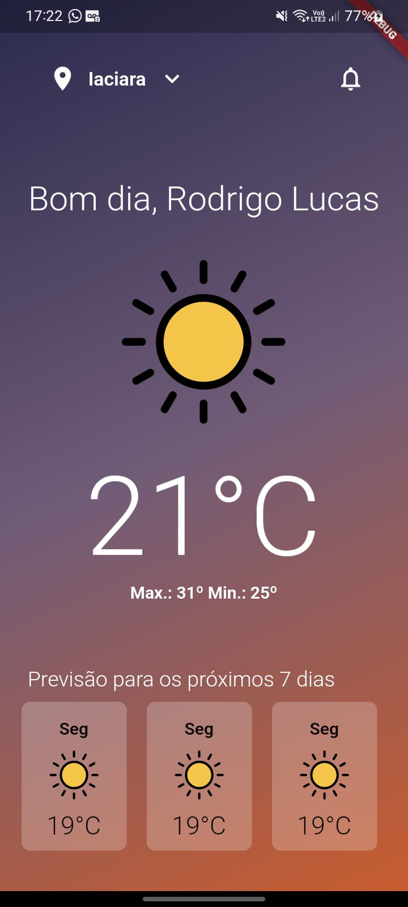

<h1 align="center">
    <a href="#" alt="App Clima"> Clima App </a>
</h1>

<h4 align="center">
	🚧   Em andamento 🚀 🚧
</h4>

## 💻 Sobre o projeto

Esté e um aplicativo de clima feito para aprimorar meus conhecimentos em flutter.

---

  

